

  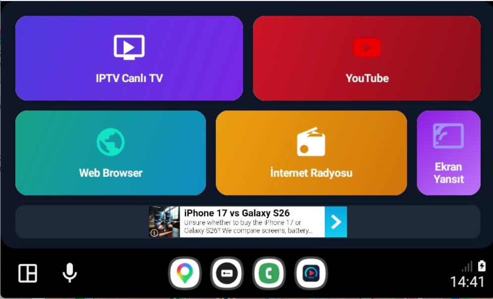

  
<em>İletişim / Contact</em> 
  

# 🚗 Auto Lite TR v4.0 - Ultimate Android Auto Entertainment & Multimedia Hub (No Root)

---

# 🇹🇷 TÜRKÇE DOKÜMANTASYON (TURKISH)

**Auto Lite TR v4.0**, Android Auto platformunun (Car App Library) katı kısıtlamalarını yıkarak; aracınızın bilgi-eğlence ekranını (Head Unit) tam teşekküllü bir multimedya merkezine dönüştüren, **Root gerektirmeyen (No Root required)**, üst düzey mimariye sahip kapalı kaynak (closed-source) bir uygulamadır.

IPTV Player, Web Browser, YouTube for Android Auto, Screen Mirroring (Ekran Yansıtma) ve Global Internet Radio özelliklerini tek bir çatı altında toplayan Auto Lite; özellikle **Direksiyon Kumandası Entegrasyonu (Steering Wheel Controls Integration)**, **Uzak Cep Telefonu Yönetimi (Remote Phone Configuration)** ve **Kendi Geliştirdiğimiz Araç İçi Ekran Klavyesi (Custom Android Auto OSK)** ile sürücülere rakipsiz, eller serbest (hands-free) bir deneyim sunar.

---

## 📥 Kurulum ve Sürüm Uyumluluk Rehberi (Installation & Compatibility)

Auto Lite TR v4.0 uygulamasını Google'ın 3. parti uygulama kısıtlamalarına takılmadan aracınızda görüntüleyebilmek için kurulumun **[KingInstaller](https://github.com/fcaronte/KingInstaller)** üzerinden yapılması zorunludur. Uygulamanın en güncel `.apk` dosyasını GitHub deponuzun **Releases** bölümünden indirebilirsiniz.

### 📱 Android Sürümlerine Göre Kurulum Tablosu

| Android Sürümü | Kurulum Yöntemi & Uyumluluk Durumu |
| :--- | :--- |
| **Android 9.0 - 13.0** | ✅ **Tam Uyumlu:** [KingInstaller](https://github.com/fcaronte/KingInstaller) kullanılarak hiçbir sorun yaşanmadan, tek tıkla kolayca kurulabilir. |
| **Android 14.0 - 15.0** | ⚠️ **Kısmi Uyumlu:** Cihaz marka, model ve OEM arayüz güvenlik kısıtlamalarına bağlı olarak bazı cihazlarda istisnai durumlar veya kurulum engelleri yaşanabilir. |
| **Android 16.0** | 🔒 **Özel Test Aşamasında:** KingInstaller desteklememektedir! Android 16 için yalnızca Google Play kapalı test altyapısı üzerinden yükleme yapılabilmektedir. (Google Play'in kısıtlı tester kontenjanı nedeniyle her isteyene test erişimi verilememektedir). |

> 📌 **Kurulum İpucu:** `KingInstaller` uygulamasını yükledikten sonra, indirdiğiniz `Auto Lite TR v4.0.apk` dosyasını KingInstaller içerisinden seçin ve **"Install as King"** butonuna basarak yüklemeyi tamamlayın.

---

## 🎥 Test Videosu ve Demo

Uygulamanın araç içi performansını, direksiyon kumandası kullanımını, özel ekran klavyesini ve arayüz dinamiklerini aşağıdaki demo videolarından inceleyebilirsiniz:

  

  <b>📺 <a href="https://youtu.be/hhLW9V4_sc8">Tanıtım Videosunu YouTube Üzerinde İzlemek İçin Buraya Tıklayın</a></b> 
  <i>(Proje içindeki test videoları: <code>images/test_video_1.mp4</code> ve <code>images/20260724_113134_fb_optimized.mp4</code>)</i>

---

## 🌟 Öne Çıkan Özellikler ve Teknik Mimari (Core Features)

### 📱 Telefondan Anlık ve Detaylı Yönetim (Real-Time Configuration)
Araçtayken ekrana dokunup ayar aramakla uğraşmayın! Auto Lite, son derece gelişmiş bir **Mobil Uygulama Kontrol Paneli** sunar. Cep telefonunuzdaki ayar menüsünden bir değişiklik yaptığınız an; `OnSharedPreferenceChangeListener` mimarisi sayesinde **milisaniyeler içinde araç ekranındaki görüntü yenilenir**.

  <table>
    <tr>
      <td align="center"><b>📱 Telefondan Yönetim Menüsü</b> 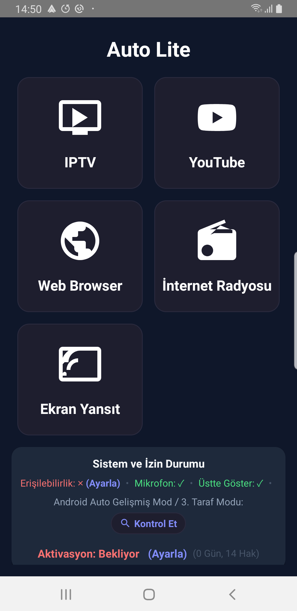</td>
      <td align="center"><b>🚗 Araç Ekranına Anlık Yansıma</b> </td>
    </tr>
  </table>

---

### 🛞 Tam Direksiyon Kumandası Entegrasyonu (Steering Wheel Controls)
Sürüş güvenliğini bozmadan maksimum kontrol! Uygulamamız, aracınızın donanımsal medya tuşlarıyla kusursuz konuşmak için `MediaSessionCompat` ve Android Auto donanım API'lerini doğrudan kullanır.

* **YouTube Entegrasyonu (JS Injection):** Sadece IPTV değil, **YouTube izlerken de direksiyon kumandanız aktif!** Direksiyondan ileri/geri (Next/Prev) tuşlarına basarak YouTube videolarını 10 saniye ileri/geri sarabilir, oynatıp duraklatabilirsiniz.
* **IPTV ve Radyo (Zapping):** Direksiyondaki tuşlarla binlerce M3U kanalı veya internet radyosu arasında saniyeler içinde geçiş yapın.

  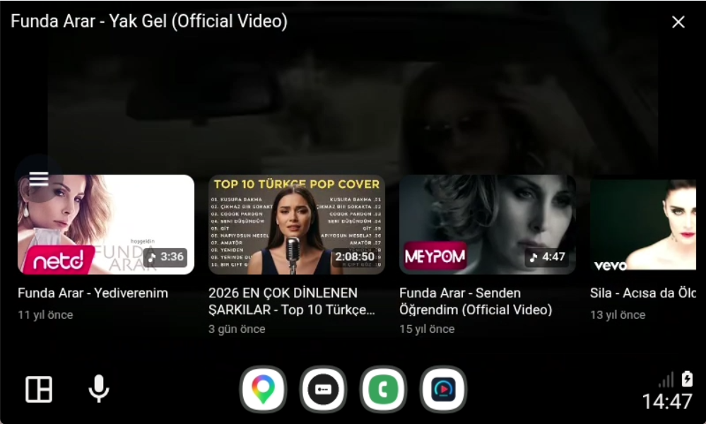
  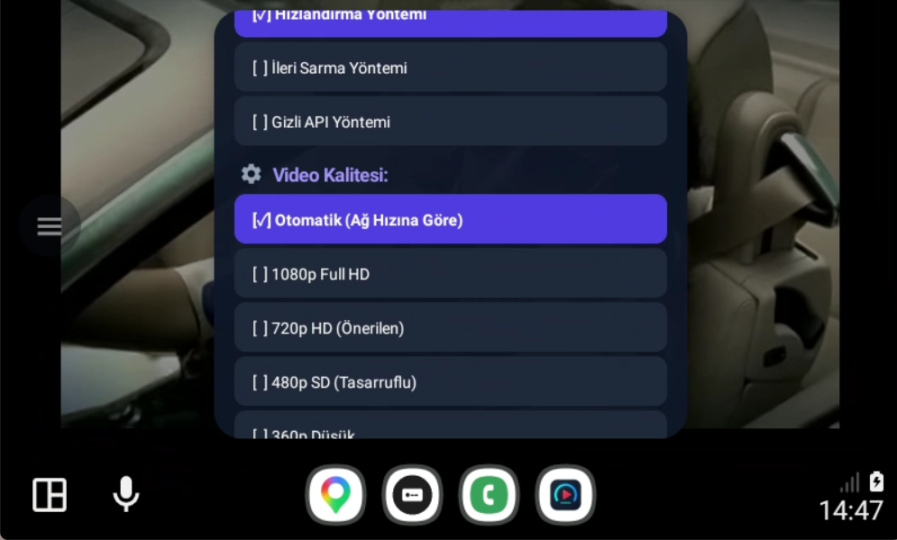

---

### ⌨️ Özel Araç İçi Ekran Klavyesi (Custom On-Screen Keyboard)
Google'ın Android Auto üzerindeki 3. parti uygulamalara uyguladığı "klavye açılamaz" (No Keyboard Support) limitini tamamen hack-free bir yöntemle aştık! Auto Lite, kendi UI katmanında (Canvas) özel olarak render edilen akıllı bir dokunmatik klavyeye (`Custom OSK for Android Auto`) sahiptir.

  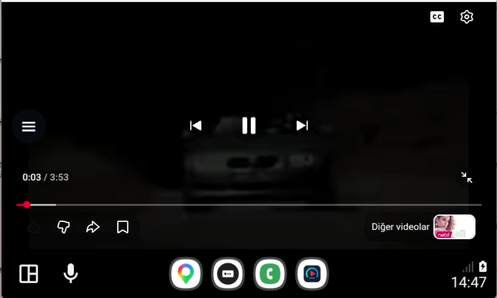
  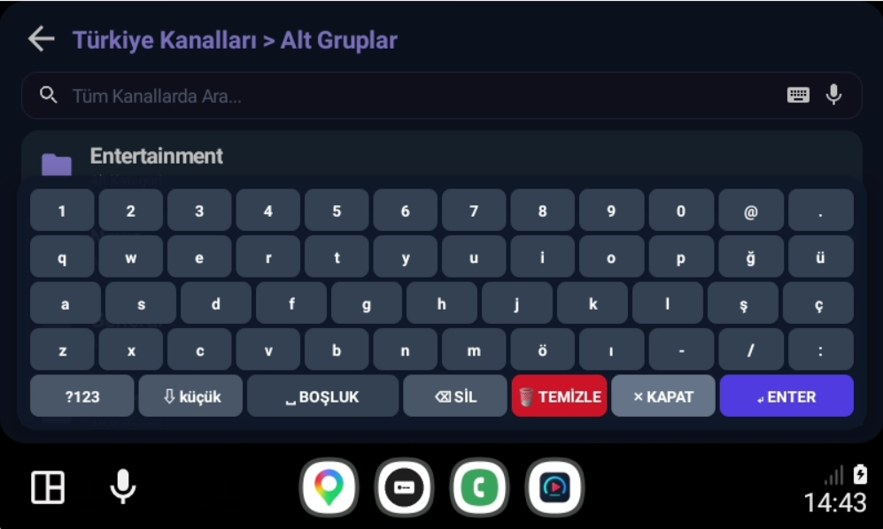
  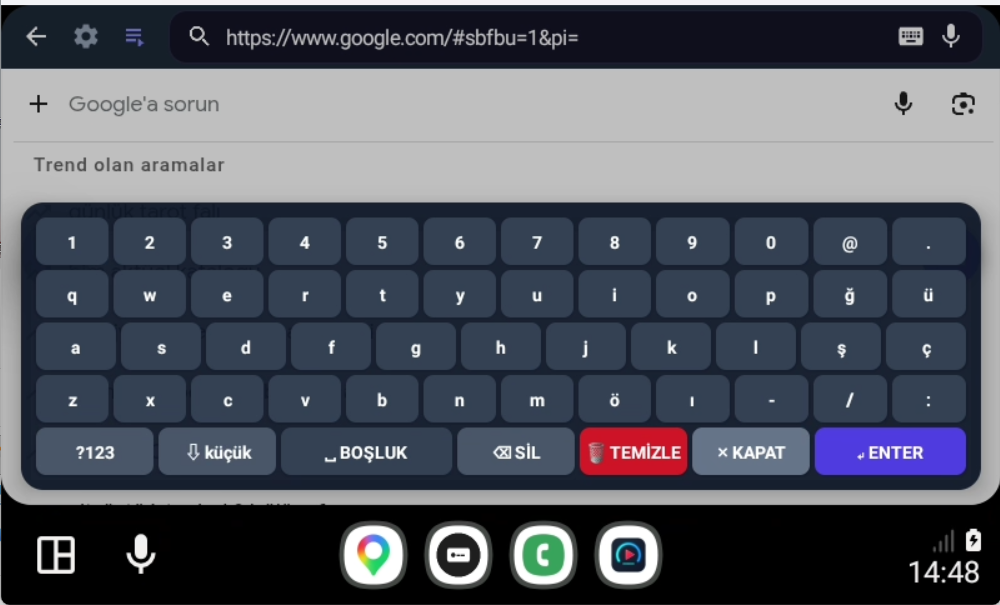

---

### 📺 Gelişmiş Canlı TV Motoru (Advanced IPTV Player & M3U Parser)
ExoPlayer donanım ivmelendirmesi (Hardware Acceleration) ile güçlendirilmiş, takılmasız canlı TV deneyimi. Binlerce kanallık M3U listelerini saniyeler içinde parse eden motor, akıllı önbellekleme ve favori yönetim sistemine sahiptir.

  <table>
    <tr>
      <td align="center"><b>📱 Telefon IPTV Ayarları</b> 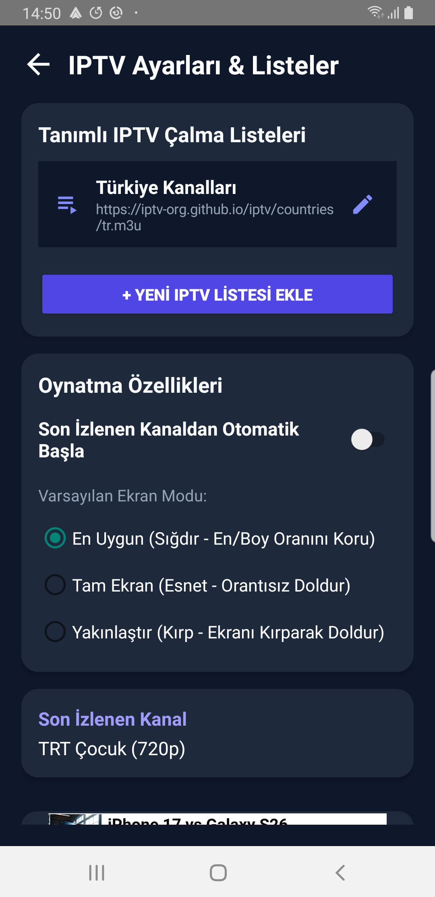</td>
      <td align="center"><b>📺 Araç İçi Kanal Listesi</b> 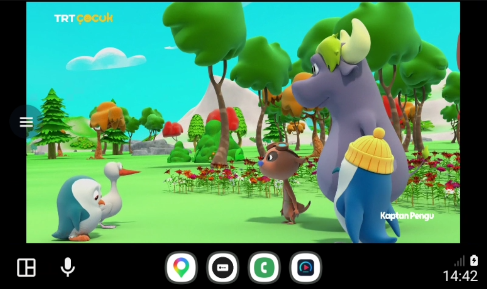</td>
      <td align="center"><b>📺 Canlı TV Tam Ekran</b> 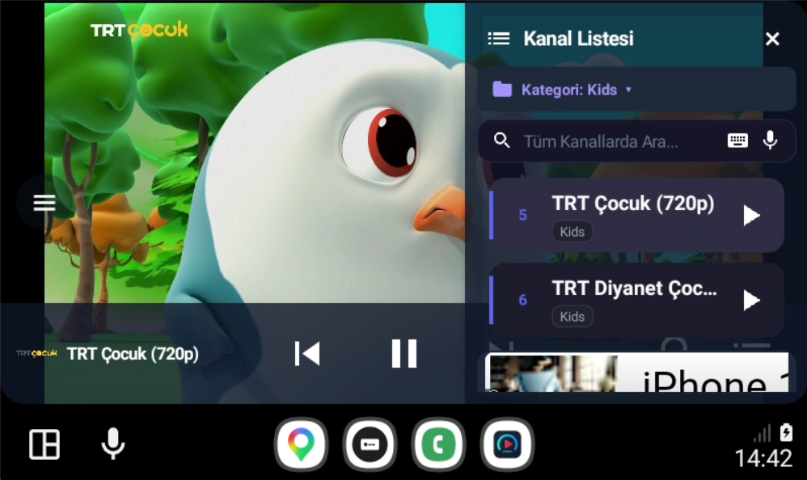</td>
    </tr>
  </table>

---

### 📻 Akıllı Radyo Modülü (Intelligent Web Radio & Audio Focus)
Arka planda kesintisiz çalışan, dünyanın her yerinden radyolara erişim sağlayan akıllı modül.

* **Ses Odaklanması Çatışma Çözümü (Audio Focus Handling):** Android Auto'nun `CarAudioManager` sistemiyle tam entegre çalışır. IPTV veya başka bir kaynaktan radyoya geçtiğinizde ses kanallarını mükemmel yönetir.
* **Fail-Safe Server Routing:** Global API çökse bile (502 Bad Gateway), sistem otomatik olarak en stabil aktif sunucuya bağlanır.
* **Dinamik Ses Spektrumu (Audio Visualizer):** Müziğin ritmine göre hareket eden, donanım ivmeli görsel animasyonlar.

  <table>
    <tr>
      <td align="center">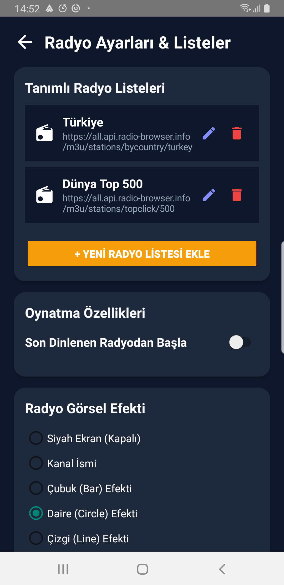 <b>📱 Radyo Ayarları</b></td>
      <td align="center">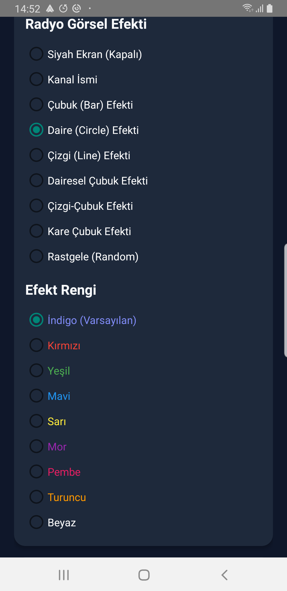 <b>📱 İstasyon Listesi</b></td>
      <td align="center">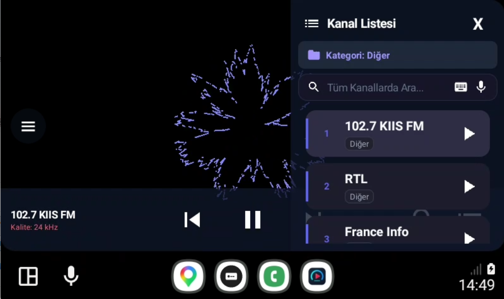 <b>📻 Visualizer Ekranı</b></td>
      <td align="center">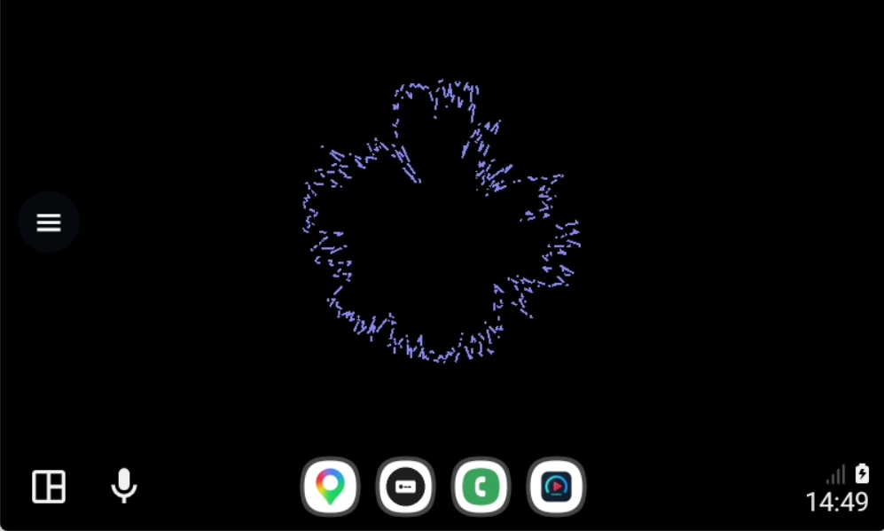 <b>📻 Gece Modu Visualizer</b></td>
    </tr>
  </table>

---

### 🌐 Reklam Engelleyicili Tarayıcı ve YouTube (AdBlock & Web Browser)
* **Sıfır Reklam:** Geliştirdiğimiz özel JS Injection (AdBlocker Script) stratejisi sayesinde YouTube veya web sitelerindeki sponsorlu içerikler ve reklamlar siz görmeden anında engellenir.
* **Görünüm Kontrolü:** Özelleştirilebilir User-Agent spoofing ile araç ekranına özel Masaüstü/Mobil/Tablet görünümleri.

  <table>
    <tr>
      <td align="center">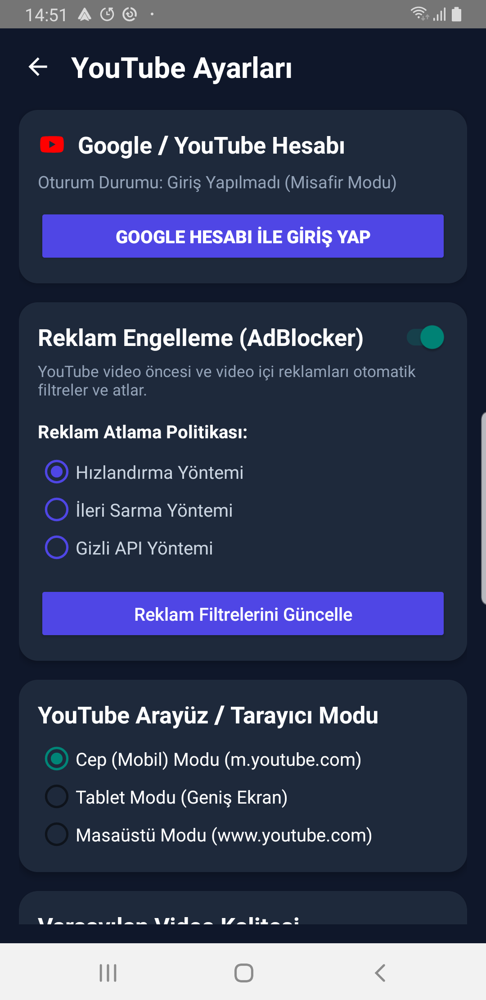 <b>📱 YouTube Çözünürlük</b></td>
      <td align="center">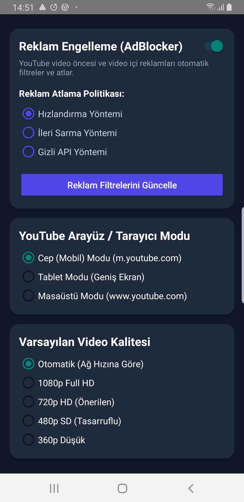 <b>📱 AdBlock Ayarı</b></td>
      <td align="center">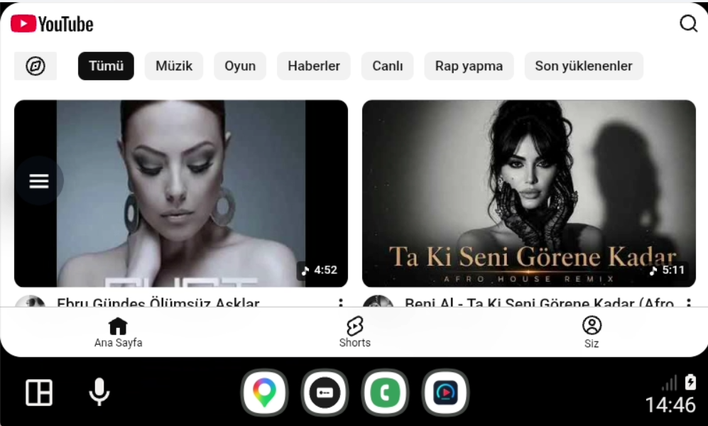 <b>🚗 YouTube Arayüzü</b></td>
      <td align="center">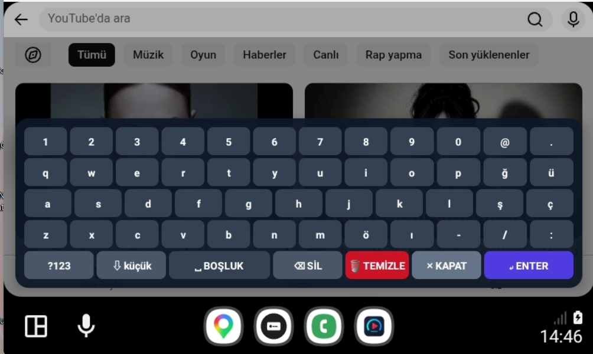 <b>🚗 Reklam-Sız Oynatma</b></td>
    </tr>
  </table>

  <table>
    <tr>
      <td align="center">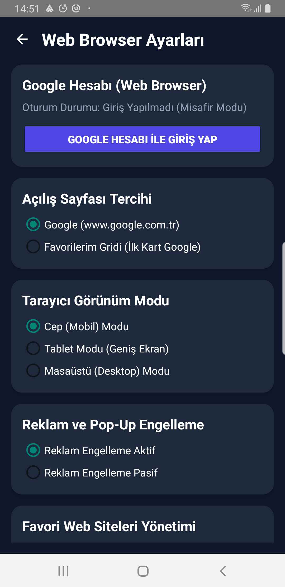 <b>📱 Web Tarayıcı Ayarları</b></td>
      <td align="center">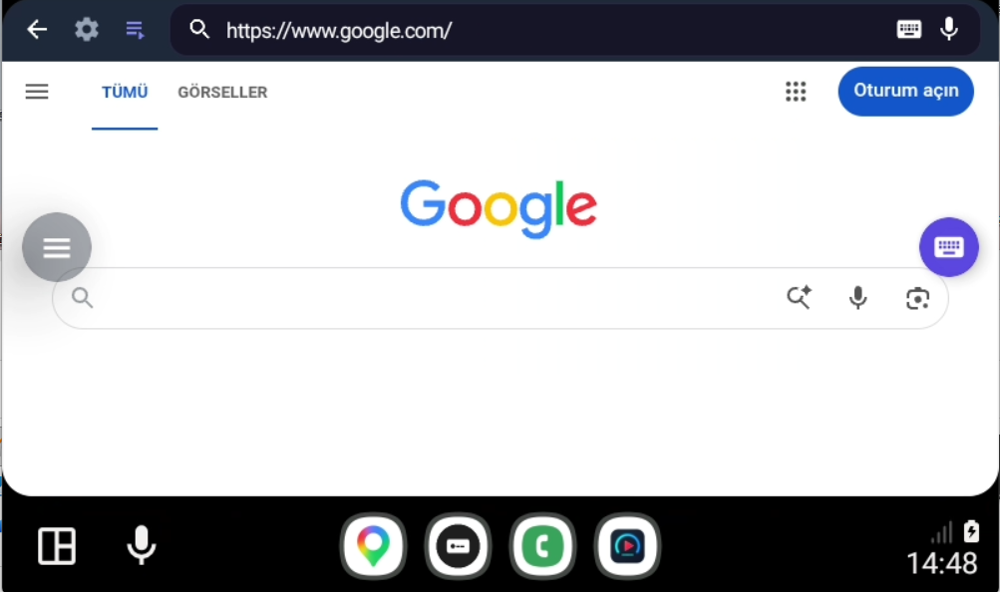 <b>🌐 Araç İçi Web Tarayıcı Deneyimi</b></td>
    </tr>
  </table>

---

## 🛠️ Arayüz ve Mimari Detaylar (UI/UX Details)
* **Yüzer Sürüklenebilir Menü Butonu (Draggable FAB):** Ekranın köşelerini kapatmaması için parmağınızla istediğiniz yere sürükleyebileceğiniz şeffaf yüzer buton (Z-index layering).
* **Merkezi Kontrol Paneli (Center Modal Control Panel):** Sürüş esnasında dikkati dağıtmamak için tüm geçişleri ve kontrolleri tek bir ekranda toplayan göz yormayan Dark Mode uyumlu arayüz.
* **Durum Kurtarma ve Otomatik Devam (State Recovery & Auto-Resume):** Uygulamayı kapatıp açtığınızda, en son izlediğiniz kanal veya radyo kaldığı yerden saniyeler içinde otomatik başlar.

---

## 🏷️ Size Özel Beyaz Etiket Çözümleri (White-Label Solutions)
Geliştirdiğimiz bu devasa altyapıyı sizin markanıza özel hale getirebiliriz:
* **Sizin Markanız:** Sizin belirleyeceğiniz özel uygulama adı ve logolar.
* **Size Özel Altyapı:** Tamamen size ait benzersiz `com.sirketiniz.uygulamaadi` paket adı.
* **Üst Düzey Güvenlik:** Kırılamaz özel şifreleme (Obfuscation / ProGuard) ile kod koruması.
* **Bağımsız Kazanç:** Uygulamayı doğrudan kendi **Google Play Developer** hesabınıza yükleyip tüm gelir modelini kendiniz yönetebileceğiniz hazır ve imzalı `.aab` paketleri.

Bu iş fırsatını değerlendirmek ve kendi Android Auto projenizi başlatmak için detayları görüşmek üzere iletişim kurabilirsiniz.

   
---
---
---
   

# 🇺🇸 İNGİLİZCE DOKÜMANTASYON (ENGLISH)

# 🚗 Auto Lite TR v4.0 - Ultimate Android Auto Entertainment & Multimedia Hub (No Root)

**Auto Lite TR v4.0** is a closed-source application featuring a high-end architecture that breaks down the strict limitations of the Android Auto platform (Car App Library). It transforms your vehicle's infotainment screen (Head Unit) into a fully-fledged multimedia hub **without requiring any Root access (No Root required)**.

Bringing together an IPTV Player, Web Browser, YouTube for Android Auto, Screen Mirroring, and Global Internet Radio under a single roof, Auto Lite offers drivers an unrivaled, hands-free experience—especially through its **Steering Wheel Controls Integration**, **Remote Phone Configuration**, and our proprietary **Custom Android Auto OSK (On-Screen Keyboard)**.

---

## 📥 Installation & Version Compatibility Guide

To bypass Google's 3rd-party app restrictions on Android Auto and display Auto Lite TR v4.0 on your vehicle's head unit, installation must be performed via **[KingInstaller](https://github.com/fcaronte/KingInstaller)**. You can download the latest `.apk` release directly from our GitHub Releases section.

### 📱 OS Compatibility Matrix

| Android Version | Installation Method & Compatibility Status |
| :--- | :--- |
| **Android 9.0 - 13.0** | ✅ **Fully Compatible:** Seamless, one-click installation via [KingInstaller](https://github.com/fcaronte/KingInstaller) with zero issues. |
| **Android 14.0 - 15.0** | ⚠️ **Partially Compatible:** Installation stability may vary depending on device brand, model, and OEM software security restrictions. |
| **Android 16.0** | 🔒 **Closed Testing Only:** Not supported via KingInstaller! Installation for Android 16 is restricted strictly to Google Play Closed Testing infrastructure. (Due to limited tester slots by Google Play, test access cannot be granted to everyone). |

> 📌 **Installation Tip:** After installing `KingInstaller`, select the downloaded `Auto Lite TR v4.0.apk` file from inside KingInstaller and click the **"Install as King"** button to complete the setup.

---

## 🌟 Core Features & Technical Engineering

### 📱 Real-Time Phone Configuration
No more struggling to navigate settings by touching the vehicle screen while on the road! Auto Lite offers a highly advanced **Mobile App Control Panel**. The moment you change a setting on your smartphone, the **image on the vehicle screen updates within milliseconds** thanks to our `OnSharedPreferenceChangeListener` architecture.

### 🛞 Advanced Steering Wheel Controls
Maximum control without compromising driving safety! Our application directly utilizes `MediaSessionCompat` and Android Auto hardware APIs to communicate flawlessly with your vehicle's physical media buttons.
* **YouTube Integration (JS Injection):** Your steering wheel controls remain active **not only during IPTV playback but also while watching YouTube!** Fast-forward/rewind YouTube videos by 10 seconds, play, and pause simply by pressing the Next/Prev buttons on your steering wheel.
* **IPTV & Radio Zapping:** Easily switch between thousands of M3U channels or internet radio stations in seconds using physical buttons.

### ⌨️ Custom In-Car On-Screen Keyboard
We bypassed Google's "No Keyboard Support" restriction imposed on 3rd-party apps on Android Auto using a completely hack-free method! Auto Lite features an intelligent touch keyboard (`Custom OSK for Android Auto`) specially rendered on its own UI layer (Canvas).

### 📺 Advanced IPTV Player & M3U Parser
A stutter-free live TV experience powered by ExoPlayer Hardware Acceleration. Features a robust engine that parses M3U playlists with thousands of channels in mere seconds, complete with dynamic categories and smart caching.

### 📻 Intelligent Web Radio & Audio Focus Management
An intelligent module running seamlessly in the background, providing access to global radio stations.
* **Audio Focus Handling:** Fully integrated with Android Auto's `CarAudioManager` system. When switching to the radio from IPTV or another source, it manages audio channels perfectly without causing sound clipping.
* **Fail-Safe Server Routing:** Even if the global API crashes (502 Bad Gateway), the system automatically connects to the most stable active server.
* **Dynamic Audio Visualizer:** Hardware-accelerated visual animations that move to the rhythm of the music.

### 🌐 AdBlock YouTube & Web Browser
* **Zero Ads:** Thanks to our proprietary JS Injection (AdBlocker Script) strategy, sponsored content and advertisements on YouTube or websites are blocked instantly before you even see them.
* **View Control:** Customizable User-Agent spoofing to display Desktop/Mobile/Tablet views tailored specifically for vehicle screens.

---

## 🛠️ UI/UX & Architecture Details
* **Draggable FAB (Floating Action Button):** A transparent floating button that you can drag anywhere with your finger so it doesn't obstruct screen corners (Z-index layering).
* **Center Modal Control Panel:** An eye-friendly, Dark Mode-compatible interface that gathers all transitions and controls on a single screen to prevent distraction while driving.
* **State Recovery & Auto-Resume:** When you close and reopen the application, your last watched channel or radio station automatically resumes from where it left off in seconds.

---

## 🏷️ Tailored White-Label Solutions
We can customize this massive infrastructure specifically for your brand:
* **Your Brand:** Custom application name and logos determined by you.
* **Dedicated Infrastructure:** A unique package name (`com.yourcompany.appname`) belonging entirely to you.
* **High-End Security:** Code protection with unbreakable, advanced encryption (Obfuscation / ProGuard).
* **Independent Revenue:** Ready-to-deploy, signed `.aab` packages that you can directly upload to your own **Google Play Developer** account and manage the entire revenue model independently.

Feel free to get in touch to discuss details, evaluate this business opportunity, and launch your own Android Auto project.

---

*This robust Android Auto application is designed to push the limits of Car App Development, bypassing generic OEM restrictions to deliver a true in-car entertainment system. Includes complex implementations of ExoPlayer, WebView JS Injection, MediaSessionCompat, and SharedPreferences synchronization. (Closed-Source)*
